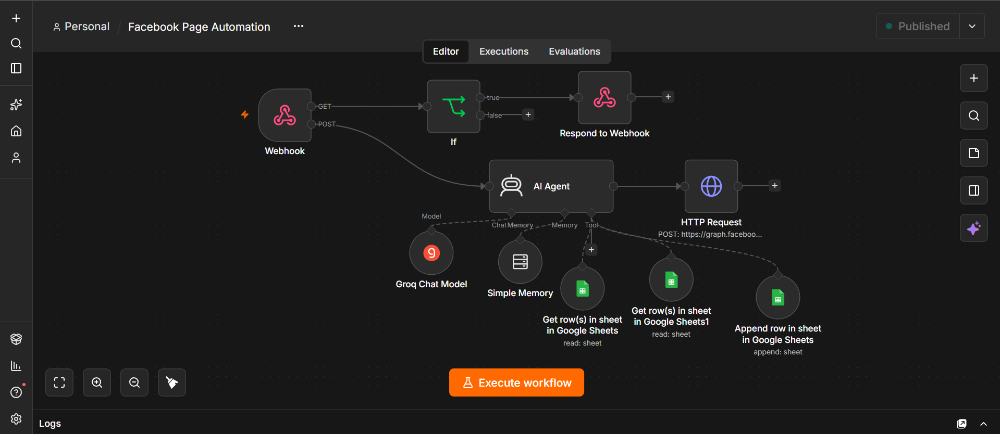

# 🤖 Facebook Page AI Automation with n8n, Groq & Google Sheets

An intelligent, 24/7 automated customer service and lead management system for Facebook Pages. Built using **n8n**, this workflow connects incoming Facebook messages to an **AI Agent powered by Groq (LLM)**, retains conversational context using **Chat Memory**, and dynamically interacts with **Google Sheets** for real-time inventory lookups and automated order capturing.

---

## 📸 Workflow Architecture

---

## 🚀 Key Benefits

- **⏰ 24/7 Instant Response:** Automatically responds to customer messages with zero delay, ensuring inquiries are answered immediately.
- **🧠 Context-Aware Conversational AI:** Uses `Simple Memory` and `Groq LLM` to remember prior interactions, allowing natural, human-like conversations instead of robotic canned responses.
- **📊 Automated Order & Lead Tracking:** 
  - Automatically records customer orders, names, phone numbers, and delivery addresses into **Google Sheets** (`Append row`).
  - Dynamically searches product sheets for pricing and stock availability (`Get row`).
- **⚡ Ultra-fast & Cost-Effective:** Powered by Groq's high-speed inference for instant sub-second responses at near-zero operating costs.
- **💼 Zero SaaS Monthly Fees:** 100% self-hosted and customizable, eliminating expensive monthly chatbot subscriptions.

---

## 🛠️ How It Works

1. **Facebook Webhook:** Receives incoming messages and handles Facebook's webhook verification handshake.
2. **If Router:** Filters verification requests vs. actual customer messages.
3. **AI Agent Core:**
   - **Groq Chat Model:** Understands customer intent and generates natural responses.
   - **Simple Memory:** Maintains context across conversation turns.
   - **Google Sheets Tools:** Queries FAQ & product data and automatically appends confirmed customer orders.
4. **Facebook Graph API (HTTP Request):** Sends the generated response directly back to the customer on Facebook Messenger.

---

## 🔑 Required Credentials & Configuration

To run this workflow in your own n8n instance, you need to configure the following credentials:

| Service | What You Need | Where to Configure in n8n |
| :--- | :--- | :--- |
| **Meta for Developers** | Page Access Token & Webhook Verify Token | In the `Webhook` node (Verify Token) & `HTTP Request` node (Access Token). |
| **Groq Cloud** | Groq API Key | In the `Groq Chat Model` node credentials. |
| **Google Cloud / Sheets** | Google OAuth2 Credentials & Spreadsheet ID | In the `Google Sheets` nodes. |

> 🔒 **Security Notice:** Never hardcode your real production tokens or API keys directly into public repositories. Always use n8n's built-in Credential Manager or environment variables.

---

## 📋 Google Sheets Setup

Create a Google Spreadsheet named **Facebook Page** with the following sheet tabs:

1. **`Prouduct`**: Columns for `Product Name`, `Available Quantity`, `Unit`, and `Unit Price`.
2. **`FAQ`**: Common customer questions and answers for the AI Agent to reference.
3. **`Order`**: Columns to capture customer orders:
   - `Order ID`
   - `Customer Name`
   - `Phone Number`
   - `Product Name`
   - `Quantity`
   - `Unit`
   - `Unit Price`
   - `Total Price`
   - `Delivery Address`
   - `Order Status`
   - `Order Date`

---

## 📦 How to Import & Run

1. Clone or download the `.json` workflow file from this repository.
2. In your **n8n** canvas, click the menu (`...`) and select **Import from File**.
3. Select the downloaded JSON file.
4. Replace the placeholder values:
   - Replace `YOUR_FACEBOOK_PAGE_ID` with your actual Facebook Page ID.
   - Replace `YOUR_FACEBOOK_PAGE_ACCESS_TOKEN` with your Page Access Token.
   - Replace `YOUR_VERIFY_TOKEN` with your webhook verification token.
   - Replace `YOUR_GOOGLE_SHEET_ID` with your Google Spreadsheet ID.
5. Link your **Groq API** and **Google Sheets OAuth2** accounts.
6. Toggle the workflow to **Published** and start automating!

---

## 👨‍💻 Author
- **Sajjad Pavel** - [@joinwithsajjad](https://github.com/joinwithsajjad)
